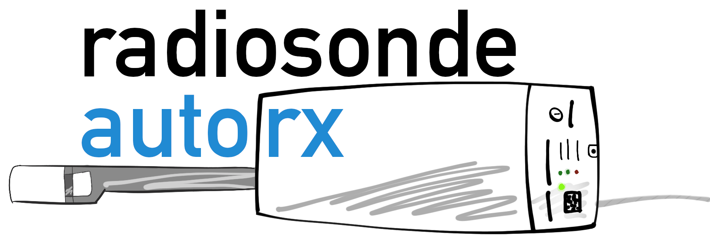

# Automatic Radiosonde Receiver Utilities

**Please refer to the [auto_rx wiki](https://github.com/projecthorus/radiosonde_auto_rx/wiki) for the latest information.**

This fork of [rs1279's RS](https://github.com/rs1729/RS) codebase
provides a set of utilities ('auto_rx') to allow automatic reception
and uploading of
[Radiosonde](https://en.wikipedia.org/wiki/Radiosonde) telemetry to
multiple services, including:

* The [Habitat High-Altitude Balloon Tracker](https://tracker.sondehub.org)
  
* APRS-IS (for display on sites such as [radiosondy.info](https://radiosondy.info) and [aprs.fi](https://aprs.fi)

* [ChaseMapper](https://github.com/projecthorus/chasemapper) for mobile
  radiosonde chasing.

There is also a web interface available on http://localhost:5000 ,
allowing display of station status and basic tracking of the sonde
position.

Currently we support the following radiosonde types:
* Vaisala RS92
* Vaisala RS41
* Graw DFM06/DFM09/DFM17/PS-15
* Meteomodem M10 & M20
* Intermet iMet-4 (and 'narrowband' iMet-1 sondes)
* Lockheed Martin LMS6 (400 MHz and 1680 MHz variants, including the new 'LMS-X' unreleased type)
* Meisei iMS-100

Support for other radiosondes may be added as required (please send us
sondes to test with!)

This software performs the following steps:

1. Use rtl_power to scan across a user-defined frequency range, and
   detect peaks in the spectrum.

2. For each detected peak frequency, run the rs_detect utility, which
   determines if a radiosonde signal is present, and what type it is.

3. If a radiosonde signal is found, start demodulating it, and upload
   data to various internet services.

4. If no peaks are found, or if no packets are heard from the
   radiosonde in a given amount of time (2 minutes by default), go back
   to step 1.

The latest version can make use of multiple RTLSDRs to allow for
tracking of many radiosondes simultaneously. The number of
simultaneous radiosondes you can track is limited only by the number
of RTLSDRs you have setup!

Refer to the wiki for the [latest updates, and installation/setup
instructions](https://github.com/projecthorus/radiosonde_auto_rx/wiki).

**This software is under regular development. Please [update
  regularly](https://github.com/projecthorus/radiosonde_auto_rx/wiki/Performing-Updates)
  to get bug-fixes and improvements!**

### Contacts
* [Mark Jessop](https://github.com/darksidelemm) - vk5qi@rfhead.net
* [Michaela Wheeler](https://github.com/TheSkorm) - radiosonde@michaela.lgbt

You can often find us in the #highaltitude IRC Channel on
[Freenode](https://webchat.freenode.net/).
